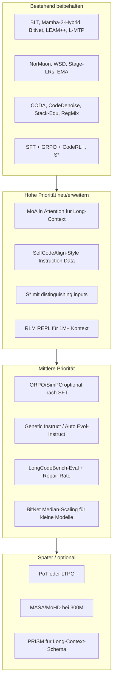

# SOTA 300M Code-LLM: Gesamtplanung (alles in einer Datei)

**Repo-Kontext:** LLM+ (model/, data/, training/, inference/, evaluation/, post_training/).  
**Ziel:** Maximal 300M Parameter, starke Instruction-Performance, Long-Context; alles Wichtige aus Forschung und Codebase in einem Dokument.

---

## A. Ausgangslage (Bestehendes im Repo)

Das Konzept baut auf dem **Best-in-Class 150M Plan** und der **Instruction SFT + RL Pipeline** auf. Laut Codebase sind umgesetzt:

- **Architektur:** BLT (Byte Latent Transformer), Mamba-2-Hybrid (43/7/50), LEAM++ (AST-Grammar-Constraint), BitNet b1.58, L-MTP, QK-Norm + Value Residual (model/config.py, model/gpt.py)
- **Training:** NorMuon-AdamW, WSD/Stage-LRs, Checkpoint-EMA, Gradient Checkpointing, dreistufige Daten-Pipeline
- **Daten:** CODA (adversarial Code-Deltas), CodeDenoise (Syntax-Semantik), RegMix-Proxy, Stack-Edu-fokussierte Stages
- **Post-Training:** SFT (ChatML, Assistant-Only-Loss), GRPO mit Execution-Reward, CodeRL+ (Semantics-Match)
- **Inferenz:** S* (Kandidaten + Sandbox-Selektion), LEAM Grammar Constrainer; **Stubs:** PoT, AB-MCTS, DaJ, RLM

**Noch nicht implementiert:** MoA (Mixture of Sparse Attention), MASA/MoHD (nur Config-Flags), vollwertige PoT/AB-MCTS/DaJ/RLM.

---

## B. Erweiterte Forschungsübersicht 2025–2026

**Stand:** 2026. Jeder Eintrag: **Für Laien** | **Was es bringt** | **Hält klein?** (Parameter/Compute).

### Übersicht: Besser · Schneller · Smarter

| Kategorie | Bedeutung |
|-----------|-----------|
| **Besser** | Höhere Accuracy (pass@1, Benchmarks), robustere Instruction-Following, bessere Code-Qualität. |
| **Schneller** | Weniger Training-Compute, schnellere Inferenz, weniger VRAM, weniger Rollouts. |
| **Smarter** | Sample-Effizienz, Long-Context, Test-Time-Compute, Self-Repair, bessere Daten-Nutzung. |

---

### TEIL 1: BESSER (Accuracy, Instruction, Code-Qualität)

#### 1.1 Kleine Code-LLMs (Sub-500M / Sub-300M)

| Ansatz | Für Laien | Was es bringt | Hält klein? | Quelle |
|--------|-----------|----------------|-------------|--------|
| **SmallCoder 303M** | 303M-Modell in 4 Stufen trainiert (Sprache → Code → Math → SFT). | 27,4% HumanEval, 31% MBPP pass@1; ~23× kleiner als Mistral 7B. | Ja (303M). | SmallCoder 303M, Web 2025. |
| **SmolLM2 data-centric** | Kleines Modell auf ~11T Tokens mit gestaffeltem Mix (Web, Math, Code, Instruction). | Übertrifft Qwen2.5-1.5B und Llama3.2-1B bei 1.7B. | Ja (1.7B / 360M). | arXiv:2502.02737. |
| **Mify-Coder 2.5B** | 2.5B Code-Modell mit kuratierten + synthetischen Daten und LLM-Qualitätsfilter. | Vergleichbar mit größeren Modellen; quantisiert auf Desktop nutzbar. | Ja (2.5B). | arXiv:2512.23747. |
| **Maincoder-1B** | 1B mit besserer Datenverarbeitung und RL-Post-Training. | Bis 76% HumanEval-Niveau bei geringer Latenz. | Ja (1B). | Maincode / Web 2025. |
| **Empirische SLM-Studie** | 20 SLMs (0.4B–10B) auf HumanEval, MBPP; ~10% mehr Accuracy oft nur mit ~4× VRAM. | Orientierung: kleine Modelle effizient; große Sprünge brauchen mehr Kapazität. | Ja (0.4B–10B). | arXiv:2507.03160. |

#### 1.2 Instruction Following & SFT / Alignment

| Ansatz | Für Laien | Was es bringt | Hält klein? | Quelle |
|--------|-----------|----------------|-------------|--------|
| **IA2 (ICL Activation Alignment)** | Aktivierungen vor SFT an ICL-ähnliches Verhalten anpassen. | Bessere Accuracy/Kalibrierung auf 12 Benchmarks; ICL ohne lange Prompts. | Ja (keine Extra-Parameter). | arXiv:2509.22621. |
| **ORPO** | SFT + Preference-Optimization in einer Phase, ohne Reference-Modell. | Bis +12,2% Win-Rate AlpacaEval 2.0; 125M–7B. | Ja. | ORPO (ACL/EMNLP). |
| **SimPO** | Reference-freier Reward (Ø Log-Prob) + Ziel-Marge Gewinner/Verlierer. | Bis +6,4 AlpacaEval 2, +7,5 Arena-Hard vs. DPO; weniger Speicher/Compute. | Ja. | arXiv:2405.14734. |
| **SelfCodeAlign** | Konzepte aus Seed-Code → neue Tasks → Sandbox-Validierung → nur bestandene Beispiele für SFT. | 67,1 pass@1 HumanEval+ mit 7B; übertrifft CodeLlama-70B-Instruct. | Ja (Prinzip auf 300M übertragbar). | NeurIPS 2024; BigCode. |
| **RLVR für präzise Instruktionen** | Verifizierbare Rewards (Execution) in RL. | Bessere Generalisierung auf ungesehene Constraints (IFEval-Style). | Ja. | arXiv:2507.02833. |
| **SFT-Best-Practices (kleine LLMs)** | Größere Batches + niedrigere LR; frühe Dynamik sagt finale Performance vorher. | Bessere MMLU/MT-Bench; Early Stopping spart Compute. | Ja. | arXiv:2412.13337. |

#### 1.3 HumanEval / MBPP & pass@k

| Ansatz | Für Laien | Was es bringt | Hält klein? | Quelle |
|--------|-----------|----------------|-------------|--------|
| **SvS (Self-Play + Variational Problem Synthesis)** | Viele Varianten derselben Aufgabe, gleiche Referenzantwort; Policy kollabiert nicht. | +18,3% und +22,8% pass@32 auf competition-style; 3B–32B. | Ja. | arXiv:2508.14029. |
| **PKPO (Pass@K Policy Optimization)** | RL optimiert direkt pass@k (z. B. pass@4) mit low-variance Schätzern. | Stärkeres pass@1 und pass@k; bessere Exploration. | Ja. | arXiv:2505.15201. |
| **Top Pass Ranking** | Code-Samples nach pass@k-artigem Loss ranken; bestes zuerst. | ~32,9% relative pass@1 auf CodeContests. | Ja (nur Ranking). | Frontiers of Computer Science 2025. |
| **ACECODER** | RL mit Execution-Reward und synthetisierten Testfällen. | >25% HumanEval-plus, ~6% MBPP-plus; 7B ≈ 236B in best-of-32. | Ja (7B–32B). | ACL 2025; arXiv:2502.01718. |
| **RLEF** | End-to-End-RL mit Execution-Feedback. | SOTA Competitive Programming 8B/70B; ~10× weniger Samples. | Ja. | arXiv:2410.02089. |

---

### TEIL 2: SCHNELLER (Training, Inferenz, weniger Compute)

#### 2.1 Training & Optimizer

| Ansatz | Für Laien | Was es bringt | Hält klein? | Quelle |
|--------|-----------|----------------|-------------|--------|
| **NorMuon** | Optimizer mit neuronweiser Normalisierung; weniger Varianz als reines Muon. | ~21% weniger Schritte vs. AdamW, ~50% weniger VRAM für Optimizer States. | Ja. | NorMuon OpenReview/arXiv:2510.05491. |
| **2-GRPO** | Nur 2 Rollouts pro Prompt statt 16; GRPO als kontrastives Lernen (nahe DPO). | ~98,1% der 16-GRPO-Performance mit 12,5% Rollouts; >70% kürzere Trainingszeit. | Ja. | OpenReview „It Takes Two“; arXiv:2510.00977. |
| **AERO** | Adaptive Rollout-Strategien, selektive Ablehnung, Bayesian Posteriors. | ~48% weniger Training-Compute, ~45% weniger Wall-Clock; gleiche oder bessere Performance. | Ja. | arXiv:2602.14338. |
| **PODS** | Nur Teilmenge der Rollouts für Updates (max-Varianz Down-Sampling). | Spitzen-Genauigkeit mindestens 1,7× schneller als Vanilla-GRPO. | Ja. | arXiv:2504.13818. |
| **L-MTP** | Modell sagt 2–4 nächste Tokens vorher; weniger Decode-Schritte. | +12% HumanEval, +17% MBPP (13B); bis 3× schnellere Inferenz. | Ja (MTP-Head klein). | Gloeckle et al., ICML 2024. |

#### 2.2 Inferenz-Geschwindigkeit

| Ansatz | Für Laien | Was es bringt | Hält klein? | Quelle |
|--------|-----------|----------------|-------------|--------|
| **Speculative Decoding (kleiner Draft)** | Kleines Draft-Modell schlägt Tokens vor; Hauptmodell prüft in einem Batch. | 1,5–6,5× schnellere Decode; lossless. | Ja: Hauptmodell 300M; Draft ~15–30M. | Diverse 2025–2026. |
| **Cascade Decoding** | Zuerst kleines Modell; bei Unsicherheit größeres Modell. | ~40–60% weniger Kosten/Latenz; Qualität durch Deferral. | Ja: 300M als erste Stufe. | CASCADIA etc. |
| **Multi-Candidate / Adaptive Acceptance** | Mehrere Kandidaten oder variable Länge; längster korrekter Präfix akzeptiert. | ~2–4× über Baseline Speculative; lossless. | Ja. | SpecDec++, HeteroSpec, EARS. |
| **Draft–Target Vocab Mismatch** | Draft und Hauptmodell können unterschiedliche Tokenizer haben; Match über String/Semantik. | Bis ~2,8–5× Speedup; lossless oder >99% Accuracy. | Ja. | SLEM, TLI, FLy. |
| **Quantisierung (FP8 / INT4)** | Gewichte/KV in 8-bit oder 4-bit. | ~1,2–1,7× schnellere Inferenz; 2–4× weniger Speicher. | Ja: 300M in ~0,4–0,6 GB (INT4). | Diverse 2025. |
| **KV-Cache-Optimierung** | Cache komprimieren/prunen. | ~2–2,5× Durchsatz; ~4× kleinerer Cache bei <1% Qualitätsverlust. | Ja: lange Kontexte ohne OOM. | SmallKV, KeepKV, KVCrush, MiniKV. |
| **Early Exit** | Bei Konfidenz in mittlerer Schicht aussteigen; Rest überspringen. | ~1,25–2,6× Speedup. | Ja. | Context-aware Exit, Multi-Model Exit. |
| **Hardware-in-the-Loop Design** | Architektur/Operatoren für CPU/Edge optimiert. | Bis ~2× schnellere Prefill/Decode auf CPU; >20 tok/s Consumer-CPU Q4. | Ja. | Nemotron-Flash, LFM2, SmallThinker. |

#### 2.3 Architektur (schneller bei gleicher Qualität)

| Ansatz | Für Laien | Was es bringt | Hält klein? | Quelle |
|--------|-----------|----------------|-------------|--------|
| **BitNet b1.58 / Ternary** | Gewichte -1, 0, +1; ~1,58 Bit/Parameter. Training von Anfang an so. | Deutlich weniger Speicher; ~5–6× schnellere Inferenz; Parity mit FP16. | Ja; Median-Skalierung für kleine Modelle. | JMLR 2025; BitNet b1.58. |
| **Hybrid Transformer–SSM (Mamba)** | Wenige Attention-Layer für Recall; viele SSM-Layer für lineare Kontext-Skalierung. | ~8× schnellere Inferenz bei langen Sequenzen; weniger KV-Cache. | Ja (43/7/50 Split). | Mamba-2, Samba, Hymba. |
| **MoE** | Pro Token nur wenige Experten aktiv; Router wählt. | +3–7% Validation Loss, 3,2× Inferenz-Speedup, ~68% weniger KV-Cache sub-300M. | Ja (17M–202M aktive Params). | MoE-MLA-RoPE, FLAME-MoE. |
| **Parameter Sharing** | Gleiche Schicht mehrfach oder geteilte Basis-Gewichte über Schichten. | Weniger Parameter bei gleicher/besserer Accuracy; ~47% niedrigere First-Token-Latenz. | Ja. | Relaxed recursive, SLlama. |
| **Deep-Thin + GQA** | Mehr Schichten, schmaler; Grouped-Query-Attention. | +2,7–4,3% Accuracy bei 125M/350M vs. breit-flach. | Ja. | MobileLLM 2024. |

---

### TEIL 3: SMARTER (Sample-Effizienz, Long-Context, Test-Time, Daten)

#### 3.1 Sample-Effizienz & Daten

| Ansatz | Für Laien | Was es bringt | Hält klein? | Quelle |
|--------|-----------|----------------|-------------|--------|
| **IMU-1-Style** | QK-Norm, per-head Gating, Value Residuals, LayerNorm-Scaling; Stage-LRs, EMA; NorMuon. | 430M auf 72B Tokens = Level von Modellen mit 56× mehr Tokens. | Ja (430M). | arXiv:2602.02522. |
| **RegMix** | Kleiner Proxy auf vielen Mixturen; Regression sagt optimale Mischung vorher. | ~6,3% über menschliche Mischung bei ~2% Extra-FLOPs; DoReMi-level bei ~10% Compute. | Ja. | ICLR 2025; data/regmix_proxy.py. |
| **PreSelect / DataDecide** | Daten vor Training nach Nutzen auswählen (Proxy/Modell). | 30B ausgewählte Tokens schlagen 300B unselektiert (~10× Compute-Reduktion). | Ja. | PreSelect, DataDecide. |
| **Curriculum Learning** | Daten nach Schwierigkeit sortiert; leicht → schwer. | 18–45% weniger Schritte bis Baseline; bis ~3,5% Gewinn als Warmup. | Ja. | Difficulty curricula, DoReMi-style. |
| **Deduplikation** | Exakte und Near-Duplicate entfernen. | Weniger Memorization; bessere Valid-Metriken; bis ~19,6% Perplexity, ~28% Laufzeit. | Ja. | Lee et al.; EP-MPD 2025. |
| **Synthetische Daten** | Training auf LLM-erzeugten Beispielen; ggf. aktiv nach Studenten-State. | Bis +101% GSM8K bei 1B vs. instruction-only; SynAlign reduziert Shift. | Ja. | BARE, Active Synthetic, SynAlign. |
| **Genetic Instruct / Auto Evol-Instruct** | Evolutions-Algorithmen für Coding-Instructions: Crossover, Mutation, Judge-LLM. | 7,5M Paare; bessere Code-Results; Auto übertrifft manuelle Evol-Instruct. | Ja. | Genetic Instruct ACL 2025. |

#### 3.2 Long-Context (128K–1M)

| Ansatz | Für Laien | Was es bringt | Hält klein? | Quelle |
|--------|-----------|----------------|-------------|--------|
| **MoA (Mixture of Sparse Attention)** | Pro Head/Layer unterschiedliche Sparse-Patterns (Window, Global, Dilated); kein Re-Training. | 3,9× effektiver Kontext; 1,5–7,1× bessere Retrieval; 8K→32K+ bei 150M. | Ja. | arXiv:2406.14909; thu-nics/MoA. |
| **Infini-Attention für SLMs** | Komprimierter Langzeit-Speicher in kleinen Transformern. | ~31% Accuracy bei 16K vs. Baseline für 300M; begrenzter Speicher. | Ja (300M). | arXiv:2512.23862; 2404.07143. |
| **LongMamba (training-free)** | Global-channel-Flaschenhälse; unwichtige Tokens filtern. | Längerer effektiver Kontext ohne Re-Training. | Ja. | arXiv:2504.16053. |
| **QMambaExtend** | Δt pro Layer bei Inferenz kalibriert; kein Training. | Bis 32× Kontext (2K→64K); ~2,1× weniger Speicher mit Quantisierung. | Ja. | ICLR 2025 Workshop. |
| **MiniCPM-SALA** | Hybrid Sparse + Linear: einige Layer sparse, die meisten linear. | ~3,5× Inferenz-Speedup bei 256K; 1M Kontext auf 32GB GPU. | Ja (Prinzip übertragbar). | arXiv:2602.11761. |
| **REFORM (KV-Cache)** | KV-Cache pro Chunk komprimiert; nötige Tokens bei Bedarf neu berechnet. | ~52% (RULER), ~34% (BABILong) bei 1M; ~30% schnellere Inferenz; ~5% weniger Peak-Memory. | Ja (inference-time). | arXiv:2506.01215. |
| **RLM (Recursive LM)** | Kontext als Umgebung; REPL mit Code-Tools; Fixed-Window (z. B. 4K) für 1M+ Tokens. | +20–30% auf Long-Context-Tasks vs. Compaction. | Ja (RLM-Stub ausbauen). | arXiv:2505.07897. |

#### 3.3 Test-Time Compute & Self-Repair

| Ansatz | Für Laien | Was es bringt | Hält klein? | Quelle |
|--------|-----------|----------------|-------------|--------|
| **S*** | Mehrere Kandidaten; differenzierende Test-Inputs; in Sandbox auswerten und besten wählen. | 3B mit S* übertrifft GPT-4o-mini; +3,7% vs. o1 auf LiveCodeBench. | Ja. | arXiv:2502.14382; EMNLP 2025. |
| **Self-Repair** | Code generieren → Sandbox → bei Fehler Fix generieren. | +17–53% SWE-bench Verified; AuPair schlägt best-of-N. | Ja (nur Inferenz-Loop). | Self-Improving Agent; InspectCoder; AuPair ICML 2025. |
| **PoT / LTPO** | PoT: transiente LoRA/GRPO zur Laufzeit. LTPO: parameter-frei, Thought-Vektoren pro Aufgabe optimieren. | PoT: +14,38 Punkte LiveCodeBench V6 bei 4B. LTPO: robust AIME. | Ja (LTPO ohne Extra-Parameter). | PoT; LTPO ICLR 2026. |
| **Agent Distillation** | Großes Agent-Verhalten (Reasoning + Tools) in kleines Modell distilliert. | 0,5B/1,5B/3B match next-tier CoT-distilliert auf 8 Reasoning-Tasks. | Ja (0,5B–3B). | arXiv:2505.17612 (NeurIPS 2025). |

#### 3.4 Curriculum & RL-Varianten

| Ansatz | Für Laien | Was es bringt | Hält klein? | Quelle |
|--------|-----------|----------------|-------------|--------|
| **Self-Evolving Curriculum (SEC)** | Curriculum von Bandit-Policy gewählt; RL-Advantage als Signal. | Bessere Generalisierung auf härtere OOD-Probleme. | Ja. | arXiv:2505.14970. |
| **Test-Time Curriculum (TTC-RL)** | Task-relevante Daten aus großem Pool für RL automatisch auswählen. | ~1,8× AIME25, ~2,1× CodeElo; pass@1 nahe pass@8-Ceiling. | Ja. | arXiv:2510.04786. |
| **FastCuRL** | Curriculum-RL mit gestaffeltem Kontext-Scaling. | 49,6% AIME 2024 mit ~50% weniger Schritten. | Ja. | arXiv:2510.26336 / 2503.17287. |
| **Tina (1,5B)** | LoRA während RL; zweiphasiges RL (Math dann Code). | 43,33% Pass@1 AIME24; ~9$ Post-Training (~260× Kostenreduktion). | Ja (1,5B). | arXiv:2504.15777. |

---

## C. Handlungsorientierte Empfehlungen (Detail)

### 1. Instruction-Performance (max 300M)

**Evidenz bestehend:** Evol-Instruct + Teacher-SFT (Genetic Instruct skaliert: 7.5M Paare); Assistant-Only-Loss, ChatML; GRPO + Execution-Reward (critic-frei, ~2× weniger Compute).

**Neu/verbessern:** ORPO oder SimPO optional nach SFT; SelfCodeAlign-ähnliche Schleife in data/instruction_data.py, data/generate_instruction_data.py (Konzepte aus Code → Multi-Sample → Sandbox-Filter → nur test-grüne Paare); Genetic Instruct oder Auto Evol-Instruct in data/instruction_data.py; SFT-Best-Practices in training/config_sft.yaml und training/sft_train.py (größerer Batch + niedrigere LR, optional Early Stopping via Gradient-Norm/Loss).

### 2. Long-Context (bis 128K+)

**Bestehend:** Mamba-2-Hybrid (linearer Kontext, geringer KV-Cache); RLM-Stub in inference/run_mlx.py.

**Neu/verbessern:** MoA in die wenigen Attention-Layer des Mamba-2-Hybrid (model/gpt.py / Mamba-Hybrid-Block), Referenz thu-nics/MoA; optional PRISM (strukturierte Schemata) für Long-Context-Aufgaben; Hymba-style KV-Sharing in 7% Attention prüfen; Lost-in-the-Middle: Medoid Voting / Dokumenten-Permutation bei Eval; LongCodeBench-Eval in evaluation/ (32K, 128K, Repair Success Rate). RLM vollständig: inference/run_mlx.py um echten REPL-Loop erweitern (Prompt → Code → Safe REPL → Ergebnis in Kontext → Iteration).

### 3. Architektur & Training

**Bereits gut:** BitNet b1.58 (Median-Skalierung für kleine Modelle in model/bitnet.py prüfen); L-MTP (Forward-Curriculum beibehalten); IMU-1-Style (QK-Norm, Value Residual in model/gpt.py); CODA/CodeDenoise in Stage-2.

**Optional bei 300M:** MASA/MoHD implementieren (nur Config-Flags bisher); Samba/Hymba als Referenz für Sliding-Window oder KV-Sharing in Attention.

### 4. Test-Time Compute & Inferenz

**S*:** inference/test_time_evolution.py (s_star_select, s_star_generate) um „distinguishing inputs“ erweitern (Tests, bei denen sich Kandidaten unterscheiden).

**PoT/AB-MCTS/DaJ:** PoT-Zyklus (Generate → Execute → LoRA/GRPO-Update) in test_time_evolution.py oder LTPO evaluieren; AB-MCTS/DaJ niedrigere Priorität.

**RLM:** Siehe Abschnitt Long-Context.

### 5. Daten & Curriculum

Stack-Edu als Kern (Classifier HuggingFaceTB/stack-edu-classifier-python, Threshold 3); RegMix in data/regmix_proxy.py weiter nutzen; Stage-3 Long-Context: LongCodeBench-Daten, synthetische Long-Trajektorien mit Context-Folding in data/prepare_data.py; Sample-Effizienz: klare Stages, EMA, Stage-LRs; Overtraining mit pro-Epoche-Eval überwachen.

---

## D. Priorisierung

### Was ihr bereits habt (Codebase)

- **Architektur:** BLT, Mamba-2-Hybrid, LEAM++, BitNet, L-MTP, QK-Norm, Value Residual.
- **Training:** NorMuon, WSD, Stage-LRs, EMA, CODA, CodeDenoise, RegMix, dreistufige Pipeline.
- **Post-Training:** SFT (ChatML, Assistant-Only), GRPO, CodeRL+, Execution-Reward.
- **Inferenz:** S* (Kandidaten + Sandbox), LEAM Constrainer; Stubs: PoT, AB-MCTS, DaJ, RLM.

### Prioritäts-Übersicht (Mermaid)

### Hohe Priorität (neu oder erweitern)

| Maßnahme | Für Laien | Erwarteter Nutzen | Hält klein? |
|----------|-----------|-------------------|-------------|
| **MoA in Attention** | Sparse-Patterns pro Head/Layer; kein Re-Training. | 8K→32K+ Kontext, bessere Retrieval. | Ja. |
| **2-GRPO oder AERO** | Weniger Rollouts pro Prompt; gleiche oder bessere RL-Qualität. | 70%+ kürzeres RL-Training. | Ja. |
| **S* mit distinguishing inputs** | Tests, bei denen sich Kandidaten unterscheiden, nicht nur Pass/Fail. | Stärkere Selektion, bessere pass@1. | Ja. |
| **SelfCodeAlign-Style Instruction** | Konzepte aus Code → Tasks → Sandbox-Filter → nur grüne Paare. | Höhere Instruction-Qualität ohne mehr Parameter. | Ja. |
| **RLM-Loop vollständig** | REPL: Code generieren → ausführen → Ergebnis in Kontext → Iteration. | 1M+ Kontext mit Fixed-Window. | Ja. |
| **Speculative Decoding** | 15–30M Draft für 300M Hauptmodell; 2–4× schnellere Decode. | Deutlich schnellere Inferenz. | Ja. |
| **LongCodeBench-Eval** | Eval bei 32K/128K; Repair Success Rate. | Messbarer Long-Context- und Repair-Erfolg. | Ja. |

### Mittlere Priorität

| Maßnahme | Für Laien | Erwarteter Nutzen | Hält klein? |
|----------|-----------|-------------------|-------------|
| **ORPO oder SimPO** | SFT + Preference in einer Phase; kein Reference-Modell. | Bessere Alignment ohne Extra-Phase. | Ja. |
| **Genetic Instruct / Auto Evol-Instruct** | Evolutions-Algorithmen für Instruction-Daten. | Skalierbare, hochwertige Instruction-Daten. | Ja. |
| **KV-Cache-Optimierung** | Cache komprimieren/prunen. | Längere Kontexte bei gleichem VRAM. | Ja. |
| **BitNet Median-Skalierung** | Robustere Skalierung für kleine Modelle. | Stabileres Training bei 100–300M. | Ja. |
| **IA2 (ICL Activation Alignment)** | Aktivierungen vor SFT an ICL anpassen. | Besseres Instruction-Following. | Ja. |

### Optional (bei Streckung auf 300M)

| Maßnahme | Für Laien | Erwarteter Nutzen | Hält klein? |
|----------|-----------|-------------------|-------------|
| **MASA / MoHD** | Parameter-Sharing in Attention; dynamische Hidden-Dimensionen. | Mehr Kapazität bei gleicher Parametergröße. | Ja. |
| **MoE (sub-300M)** | Nur wenige Experten pro Token aktiv. | Schnellere Inferenz, weniger KV-Cache. | Ja (aktive Params <300M). |
| **PoT oder LTPO** | Laufzeit-Updates oder Thought-Optimization. | Bessere Reasoning bei Test-Time. | Ja. |
| **PRISM** | Strukturierte Schemata für Long-Range-Reasoning mit kurzem Kontext. | Weniger Kontext nötig für lange Abhängigkeiten. | Ja. |

### Kurz: Sofort / Mittelfristig / Optional

- **Sofort (hoher Impact):** MoA in Attention; SelfCodeAlign-ähnliche Instruction-Pipeline; S* um distinguishing inputs; RLM-Loop; LongCodeBench (32K/128K) + Repair Success Rate in Eval.
- **Mittelfristig:** ORPO/SimPO; Genetic Instruct / Auto Evol-Instruct; BitNet Median-Scaling; SFT-Tuning (größerer Batch, niedrigere LR, Early Stopping).
- **Optional bei 300M:** MASA/MoHD; vollständiger PoT oder LTPO; PRISM.

---

## E. Referenzen (vollständig)

- **Small Code:** SmallCoder 303M, SmolLM2 (2502.02737), Mify-Coder (2512.23747), Maincoder-1B, Assessing SLMs for Code (2507.03160).
- **Instruction/Alignment:** IA2 (2509.22621), ORPO, SimPO (2405.14734), SelfCodeAlign (NeurIPS 2024), RLVR (2507.02833), SFT Guide (2412.13337).
- **pass@k / RL:** SvS (2508.14029), PKPO (2505.15201), ACECODER (2502.01718), RLEF (2410.02089), 2-GRPO (2510.00977), AERO (2602.14338), PODS (2504.13818).
- **Inferenz:** Speculative (SpecDec++, EAGLE-3, SLEM, TLI, FLy), Cascade, KV-Cache (SmallKV, KeepKV, KVCrush), Early Exit, Quantization.
- **Long-Context:** MoA (2406.14909), Infini-Attention SLMs (2512.23862), LongMamba (2504.16053), QMambaExtend, MiniCPM-SALA (2602.11761), REFORM (2506.01215), RLM (2505.07897), PRISM (2412.18914), Hymba (2411.13676), Samba.
- **Daten:** IMU-1 (2602.02522), RegMix (ICLR 2025), PreSelect, DataDecide, Curriculum, Dedup, Genetic Instruct, Auto Evol-Instruct, Stack-Edu (The Stack v2, classifier), CODA/CodeDenoise.
- **Test-Time:** S* (2502.14382), Self-Repair, AuPair (2502.18487), PoT, LTPO (ICLR 2026), Agent Distillation (2505.17612).
- **Architektur:** BitNet b1.58 (JMLR 2025), Mamba-2-Hybrid, MoE (FLAME-MoE), Parameter Sharing, Deep-Thin (MobileLLM), NorMuon (2510.05491), BLT (ACL 2025).

---

**Hinweis:** Diese Gesamtplanung kombiniert sota_300m_code_llm_research_ddfa5fa7.plan.md, planning-datei_erweitern_ba3e9b8c.plan.md und SOTA_300M_RESEARCH_2026_EXTENDED.md. Alle Angaben „Was es bringt“ sind Schätzungen aus Papers/Studien; konkrete Zahlen hängen von Modell, Daten und Setup ab. „Hält klein“ = unter 300M Parameter bzw. weniger Compute/VRAM.
