# Code-Only-LLM 100–150M – Erweiterter Plan (Pre-Training → Post-Training → Inferenz)

## Zielgröße und Trainingsplattform

- **Zielgröße: 100–150M Parameter** – Das finale Modell liegt in diesem Bereich; Konfigurationen (Depth/Width) sind darauf ausgelegt.
- **Finales Training auf RunPod mit RTX 3090:** Das produktive Training (Pre-Training und Post-Training) des 100–150M-Modells läuft **auf RunPod mit einer RTX 3090** (24 GB VRAM). RunPod ist die **Zielplattform** für den finalen Trainingslauf; die Pipeline (Daten, Code, Configs) ist so ausgelegt, dass sie dort stabil läuft. Frühe Iterationen können lokal (M2, 8 GB) oder auf Colab laufen; das **End-Training** erfolgt auf RunPod/RTX 3090.

## Fünf Säulen des Plans (Giant-Killer-Architektur)

1. **Repräsentation:** BLT (Byte Latent Transformer) – tokenizer-frei, dynamische Byte-Patches nach Entropie; Embedding-Tax eliminiert, Parameter in tiefe Schichten reinvestiert.
2. **Architektur:** Mamba-2-Hybrid (43% Mamba-2, 7% Attention, 50% MLP) + LEAM++ (Syntax-Awareness, AST); Deep-Thin (40–48 Layer, d_model=384) + MASA/MoHD.
3. **Training:** Native 1.58-Bit (BitNet b1.58 + TernaryLM) ab Epoche 1; NorMuon-AdamW-Hybrid; Leap MTP (L-MTP) mit Forward Curriculum; WSD + Stage-LRs, Checkpoint-EMA.
4. **Daten & Post-Training:** Dreistufige Pipeline (Stack-Edu, RegMix) + **CODA** (adversarial Code-Deltas) + **CodeDenoise**; Post-Training **CodeRL+** (Variable-Level Execution Trajectories, Semantics-Match-Reward) + Trajectory-Distillation.
5. **Inferenz:** Test-Time Evolution – **S*** (parallele Kandidaten + differenzierende Tests), **AB-MCTS**, **DaJ**, **PoT** (transiente LoRA/GRPO zur Laufzeit); MLX/GGUF Runtime.

---

## 1. Problemdefinition, messbare Ziele und „besser als 10× größer“

### Problemdefinition

Wir bauen ein **Decoder-only LLM**, das **ausschließlich Code und code-nahe Texte** modelliert: Docstrings, Kommentare, API-Docs, Issue-Threads. Generierter Code soll **funktional korrekt, kompilierbar und test-bestehend** sein. **Primäre Zielplattform: Python-first**, weil die Kern-Benchmarks (HumanEval, MBPP, DS-1000) Python-fokussiert sind.

**Hardware:** **Finales Training: RunPod mit RTX 3090** (24 GB VRAM) – Zielplattform für das 100–150M-Modell. Frühe Iterationen/Validierung: lokal (z.B. MacBook M2, 8 GB) oder Colab. Inferenz lokal (Apple Silicon First, MLX/vllm-mlx). **Scope:** Pre-Training → Post-Training → Inferenz; reproduzierbar und auf RunPod RTX 3090 durchlaufbar.

### Messbare Objectives (Metriken und Referenz-Repos)


| Benchmark         | Beschreibung                                                                                | Auswertung / Repo                                                                                                    |
| ----------------- | ------------------------------------------------------------------------------------------- | -------------------------------------------------------------------------------------------------------------------- |
| **HumanEval**     | 164 handgeschriebene Programmieraufgaben                                                    | Unit-Tests (funktionale Korrektheit). Offizielle Harness: [openai/human-eval](https://github.com/openai/human-eval). |
| **MBPP**          | ~1.000 „Mostly Basic Programming Problems“                                                  | Paper/Benchmark; Referenz: [google-research/mbpp](https://github.com/google-research-datasets/mbpp).                 |
| **LiveCodeBench** | „Contamination-free“-Suite, fortlaufend neue Contest-Probleme (LeetCode/AtCoder/CodeForces) | Code-Gen, **Self-Repair**, **Execution**, **Test-Output-Prediction**.                                                |
| **DS-1000**       | 1.000 realistische Data-Science-Coding-Probleme (mehrere Libraries)                         | Test-basiert + Constraint-Checks; sehr niedrige False-Accept-Rate (Paper).                                           |


### pass@k als Kernmetrik

Der Codex/HumanEval-Paper etabliert **pass@k** als Erfolgswahrscheinlichkeit bei k Samples und zeigt, dass das **Sampling-Budget** die Erfolgsrate stark beeinflusst. Für Produktionsziele: **pass@1** (latency-sensibel) **und** **pass@k** (z.B. k=5, 10, 20, mit Filter/Repair) reporten – nicht nur „genau ein Sample“.

### Zusätzliche produktionsnahe Metriken (Operational Metrics)

- **Compile-/Parse-Success-Rate** (z.B. `ast.parse` in Python)
- **Unit-Test-Success-Rate**, **Timeouts/Runtime-Errors**
- **„Repair-steps until pass“** (Anzahl Fix-Schritte bis alle Tests grün). LiveCodeBench betont Self-Repair/Execution explizit als Teil moderner Code-Bewertung.

### Definition „besser als 10× größer“ (präzise)

„10× größer“ = General-Purpose-Baseline mit **~10× Parametern** (z.B. **0.7B–1B Generalist** vs. **70–100M Spezialist**). **Sieg-Claim:** Auf einem **vorab fixierten Set** aus (HumanEval+, MBPP, DS-1000-Subset, LiveCodeBench-Fenster) erreicht das Spezialmodell bei **vergleichbarer Decode-Policy** (greedy oder gleiche Sampling-Policy) **höhere pass@1** bzw. **bessere Test-Success-Rate**. LiveCodeBench existiert u.a., um Kontamination/Overfitting in klassischen Benchmarks sichtbar zu machen.

### Drei Benchmark-Sichten (Überblick)

- **Sicht 1:** Funktionale Korrektheit Docstring→Code (HumanEval, Repeated Sampling).
- **Sicht 2:** Robuste Test-Suiten (EvalPlus HumanEval+/MBPP+); Kontaminations-Hinweise beachten.
- **Sicht 3:** Kontaminations-resistent und frisch (LiveCodeBench, DS-1000, BigCodeBench).

```mermaid
flowchart LR
  subgraph data [Daten]
    S1[Stage1 Breit]
    S2[Stage2 Sauber Edu]
    S3[Stage3 Curriculum]
    RegMix[RegMix Proxy]
  end
  subgraph pretrain [Pre-Training]
    P1[Stage1 breit]
    P2[Stage2 edukativ]
    P3[Stage3 Instruktion]
    EMA[Checkpoint EMA]
  end
  subgraph post [Post-Training]
    SFT[SFT Trajektorien]
    Dist[Distillation StarCoder2]
  end
  subgraph infer [Inferenz]
    MLX[MLX primär]
    GGUF[GGUF optional]
  end
  subgraph eval [Evaluation]
    HE[HumanEval+]
    EvalPlus[EvalPlus robust]
    LCB[LiveCodeBench]
  end
  data --> pretrain --> post --> infer
  infer --> eval
```




---

## Architektur-Entscheidung: Giant-Killer als verbindlicher Plan

Der Plan **ersetzt** das konventionelle Paradigma (BPE, reiner Decoder-Transformer, reines Next-Token-Prediction, statisches pass@k). Verbindlich sind:

- **Repräsentation:** BLT (Byte Latent Transformer), kein festes BPE-Vokabular.
- **Architektur:** Mamba-2-Hybrid + LEAM++ (Syntax-Awareness), Deep-Thin + MASA/MoHD.
- **Training:** BitNet b1.58 + TernaryLM, NorMuon-AdamW, L-MTP; dreistufige Datenpipeline inkl. CODA + CodeDenoise.
- **Post-Training:** CodeRL+ (Variable-Level Trajectories, Semantics-Match-Reward) + Trajectory-Distillation.
- **Inferenz:** Test-Time Evolution (S*, AB-MCTS, DaJ, PoT); pass@k wird durch adaptive Kandidaten + differenzierende Tests + PoT-Updates ergänzt/ersetzt.

Die folgenden Abschnitte (2. Architektur- und Trainingsprotokoll, dann Daten, Evaluation, Struktur) spezifizieren diesen Plan vollständig. Referenzen und komplementäre Forschung: Abschn. „Relevante Forschung“.

---

## 2. Architektur- und Trainingsprotokoll (Giant-Killer)

**Ziel:** Ein 150M-Parameter Code-LLM, das Modelle der 10–100× Größe (1B–15B) signifikant übertrifft – durch Abkehr von konventionellen Transformer-Paradigmen und fünf strategische Säulen. Vollständig auf **RTX 3090 (24 GB)** realisierbar.

### 2.1 Fundamentale Kritik und fünf Säulen

- **Kritik am orthodoxen Paradigma:** Ein 150M-Modell mit 32k BPE allokiert einen unverhältnismäßig großen Anteil des Parameterbudgets in der Embedding-Matrix; reine Next-Token-Prediction limitiert die Inferenz-Skalierung (pass@k nur statisches Sampling). Im Sub-200M-Regime entscheidet **funktionale Effizienz pro Parameter**, nicht die absolute Netzwerkgröße.
- **Fünf revolutionäre Säulen:**
  1. **Eliminierung der Token-Tax** durch dynamisches Byte-Patching (BLT) – Vokabular obsolet, Parameter in tiefe Schichten reinvestiert.
  2. **Hybride Architektur:** State-Space (Mamba-2) + spärliche Attention + syntax-geleitete Codegenerierung (LEAM++).
  3. **Native 1.58-Bit-Quantisierung** ab erster Epoche (BitNet b1.58 + TernaryLM) – effektives Parameterbudget bei gleichem VRAM vervielfacht.
  4. **Leap Multi-Token Prediction (L-MTP)** und **adaptive Optimierungsgeometrie** (NorMuon-AdamW) für Trainingseffizienz.
  5. **Test-Time-Compute:** Inferenz als evolutionäre Umgebung – S*, AB-MCTS, DaJ, **PoT** (transiente Gewichts-Updates zur Laufzeit).

### 2.2 Repräsentation: Byte Latent Transformer (BLT)

- **Problem BPE:** Subword-Token zerschneiden Code willkürlich, leiden unter Whitespace-Artefakten (Python-semantisch kritisch) und fehlendem zeichengenauem Verständnis. Embedding-Overhead bei 16k–24k BPE: ~20–30% des Budgets.
- **BLT:** Tokenizer-frei; operiert direkt auf Roh-Bytes. **Dynamische Patches:** Segmentierung nach Entropie des nächsten Bytes – bei vorhersehbarem Code (Boilerplate, Einrückung) große Patches; bei hoher Komplexität (Formeln, kryptische Namen) kleine Patches. Drei Module: **leichter lokaler Encoder** (n-gram Embeddings, Cross-Attention) → **latenter Transformer** (rechenintensiv) → **lokaler Decoder**.
- **Effekt:** Embedding-Overhead minimal; bis ~50% weniger Inferenz-FLOPs bei einfachen Passagen; robuster gegen OOV und Formatierungsabweichungen. BLT-Space-Modelle mit weniger Daten (z.B. 6T Bytes) erreichen BPE-Baselines wie Llama 3 oder übertreffen sie auf Charakter-Manipulation (CUTE-Benchmark). Für 150M: frei werdendes Budget vollständig in Tiefe des latenten Transformers reinvestieren.


| Eigenschaft                | BPE (16k–24k)                  | Byte Latent Transformer (BLT) |
| -------------------------- | ------------------------------ | ----------------------------- |
| Embedding-Overhead         | Hoch (~20–30%)                 | Minimal                       |
| Syntax-/Zeichenverständnis | Vokabular-abhängig             | Nativ, zeichengenau           |
| Rechenallokation           | Statisch (1 Token = 1 Forward) | Dynamisch nach Entropie       |
| Robustheit gegen Rauschen  | Gering (OOV)                   | Hoch (rohe Byte-Ströme)       |


### 2.3 Architektur: Mamba-2-Hybrid, LEAM++, Deep-Thin

**Mamba-2-Hybrid:** Reine Decoder-Only-Transformer stoßen bei kleinem Budget und langem Kontext an O(n²)- und KV-Cache-Grenzen. **Mamba-2** skaliert linear in der Sequenzlänge; reine SSMs sind jedoch schwach im In-Context-Copying (für Code kritisch). **Hybrid:** 43% Mamba-2-Layer, 7% klassische Attention-Layer, 50% MLP. Die wenigen Attention-Layer dienen als „Induction Heads“ für exaktes Abrufen von Variablen/API-Keys. Empirisch: Mamba-2-Hybrid übertrifft reine Transformer gleicher Parameterklasse (+2.65 Punkte im Schnitt); bis 8× schneller bei langer Inferenz; Kontext auf RTX 3090: 128K+ mit minimalem KV-Cache.


| Architektur              | Komplexität (Seq) | In-Context Copy (Code)   | Max. Kontext RTX 3090 |
| ------------------------ | ----------------- | ------------------------ | --------------------- |
| Reiner Transformer       | O(n²)             | Exzellent                | ~8K–16K               |
| Reines Mamba-2           | O(n)              | Schwach                  | 128K+                 |
| Mamba-2-Hybrid (43/7/50) | Quasi-linear      | Exzellent (7% Attention) | 128K+                 |


**LEAM++ (Syntax-Awareness):** Code nicht als flache Textsequenz modellieren. **LEAM/LEAM++** binden abstrakte Syntaxbäume (AST) ein: Modell sagt gültige Grammatikregeln für nicht-terminale Knoten vorher. Für 150M: **Syntax-Awareness** im latenten Transformer – parallele Eingaben aus Byte-Strom (BLT) und strukturellem Metadaten-Strom (AST-Tiefe, Knotentyp). Suchraum für Folgesequenzen wird durch formale Grammatik begrenzt; LEAM++ reduziert redundante/syntaktisch invalide Mutationen → höhere Daten-Effizienz.

**Deep-Thin + Parameter-Sharing:** Extrem tief (40–48 Layer), schmal (d_model=384). **MASA** in den 7% Attention-Layern (schichtübergreifend geteilt → ~66% weniger Attention-Parameter). **MoHD** für dynamische, temporäre Aktivierung breiterer Sub-Dimensionen bei Bedarf (z.B. verschachtelte Library-Calls).

### 2R.4 Native Quantisierung: BitNet b1.58 und TernaryLM

- **BitNet b1.58:** Alle `nn.Linear` durch **BitLinear** ersetzt; Gewichte ternär $-1, 0, +1$ (≈1.58 Bit Information). Quantisierung: $\tilde{W} = \text{RoundClip}(W/\beta, -1, 1)$; Aktivierungen INT8 (Absmax). Matrixmultiplikationen werden zu Additions-/Subtraktions-Operationen; Speicher bis ~7× geringer, Durchsatz stark erhöht.
- **Skalierungsgesetze:** 1.58-Bit-Modelle <500M bei ausreichend Daten (z.B. 4T Tokens) replizieren FP16-Performance; 150M ternär ≈ gleiche Code-Qualität wie 150M FP16 bei Bruchteil von Speicher/Compute.
- **TernaryLM:** Straight-Through-Estimator für Rundung im Backprop; **adaptive schichtweise Skalierungsfaktoren** – mittlere Schichten haben höchste Kompatibilität mit ternären Zuständen. BitNet b1.58 + TernaryLM: RTX 3090 kann das Modell trainieren wie ein ~600M FP16-Modell.

### 2.5 Optimierungsgeometrie: NorMuon-AdamW, Leap MTP (L-MTP)

**NorMuon (Neuron-wise Normalized Muon):** Muon orthogonalisiert Updates (bessere Konditionszahl), reines Muon hat hohe Varianz in Update-Normen. NorMuon kombiniert Orthogonalisierung mit **neuronenweiser Normalisierung** → Parameter-Nutzung über das kleine Netz gleichmäßig. Ergebnis: ~21% weniger Trainingsschritte vs. AdamW; ~50% weniger VRAM für Optimizer States. **Hybrid:** NorMuon für 2D-Matrizen (BitLinear), **AdamW** für 1D-Parameter (Embeddings, Biases, Skalierungsfaktoren).

**Leap Multi-Token Prediction (L-MTP):** Statt nur nächste Token (t+1, t+2, …) vorherzusagen, **strategisches Überspringen** trivialer Token (Boilerplate) und Vorhersage nicht-sequentieller, weit entfernter logischer Ankerpunkte in einem Forward-Pass. Konditioniert auf Long-Range Dependencies (z.B. Funktionsdefinition ↔ Return hunderte Zeilen später). **Forward Curriculum:** Training beginnt mit NTP, steigert stufenweise bis volle L-MTP. L-MTP integriert mit spekulativer Dekodierung → höhere Inferenzgeschwindigkeit.

### 2.6 Daten: CODA, CodeDenoise, Curriculum

- **CODA (Code Difference-Guided Adversarial Augmentation):** Adversarial Examples aus marginalen Code-Deltas (z.B. `x < y` → `x <= y`, `+` → `-`). Modell muss mikroskopische, semantisch gravierende Unterschiede differenzieren. Berichtet: +28.86% Robustheit vs. ALERT/CARROT. In **Stage 2 und Stage 3** integrieren.
- **CodeDenoise:** Rohdaten (auch Stack-Edu) enthalten Rauschen (Syntax ≠ Docstring-Semantik). CodeDenoise lokalisiert und bereinigt Inkonsistenzen → weniger Fehlvorhersagen durch widersprüchliche Trainingsdaten.
- Zusammen mit Near-Dedup und RegMix: **ultra-hochreiner**, kondensierter Korpus; Modell lernt funktionale Essenz, nicht redundante Boilerplate.

### 2.7 Post-Training: CodeRL+ (Execution-Semantics, Variable-Level)

- **Execution-zentriert:** CodeRL+ erweitert RL um **Variable-Level Execution Trajectories**. Während On-policy Rollouts: Code in Sandbox ausführen; Debugger extrahiert Variable-Zustände, Speicher bei Exceptions, Tracebacks.
- **Reward:** Nicht nur Pass/Fail, sondern **Semantics-Match-Rate** – Übereinstimmung von Modell-Output mit tatsächlicher Laufzeitsemantik. Nach CodeRL+: Modell berücksichtigt Laufzeitsemantik signifikant stärker.
- **Empirie:** +4.6% rel. Pass@1; +15.5% auf Code-Reasoning. Kombination mit Trajectory-Distillation von Teacher (z.B. Qwen2.5-Coder-7B) als Turbo-Booster für 150M.

### 2.8 Inferenz: Test-Time Evolution (S*, AB-MCTS, DaJ, PoT)

*S-Framework:** Hybrides Skalieren für Code. **Generation Stage:** Parallel N Kandidaten (z.B. N=16); schlagen öffentliche Tests fehl → execution-grounded iteratives Debugging mit Interpreter-Feedback. **Selection Stage:** Statt Majority Voting generiert S* **differenzierende Test-Inputs** (Edge Cases), bei denen sich Kandidaten unterscheiden; Auswertung in Sandbox identifiziert robusteste Lösung. Kleine 3B-Modelle mit S* übertreffen GPT-4o-mini auf LiveCodeBench.

**AB-MCTS (Adaptive Branching Monte Carlo Tree Search):** Suchbaum mit dynamischer Entscheidung: „Breite“ (neue Kandidaten) vs. „Tiefe“ (bestehenden Knoten mit Feedback verfeinern). Bayes’sche Mechanismen für UCT-Ersatz bei unbounded branching.

**DaJ (Data-Reweighted LLM Judge):** Bewertet Äste des Suchbaums; Bi-Level-Optimization; Step-by-Step-Reasoning ohne menschliche Heuristiken.

**PoT (Policy of Thoughts):** **Evolutionäre Gewichtsaktualisierung zur Laufzeit.** Gewichte werden nicht eingefroren: Ausführungs- und Konfidenz-Feedback aus der Sandbox treiben **transiente LoRA-Adapter**, die per **GRPO (Group Relative Policy Optimization)** on-the-fly aktualisiert werden. Zyklus: P1 (Problem analysieren) → TT (Hypothesen/Code entwerfen) → EE (in Sandbox testen) → P2 (Policy Shift / Gewichtsupdate). Kleine Modelle (z.B. 4B) mit PoT: +14.38 Punkte LiveCodeBench V6, schlagen Claude-Opus-4. Für 150M: Modell lernt aus Fehlern während der Session auf Parameterebene.

### 2.9 Hardware-Mapping RTX 3090 und Fazit

- **VRAM:** Native 1.58-Bit reduziert 150M-Parameter-Volumen auf wenige hundert MB. BLT eliminiert große Embedding-Matrix. NorMuon ~21 GB für Optimizer States → Spielraum für große Batch-Größen und L-MTP-Heads. Mamba-2-Hybrid: minimaler KV-Cache → 128K+ Kontext ohne OOM.
- **Inferenz:** MLX (Apple Silicon) oder RTX 3090; PoT mit temporären LoRA-Updates im Unified Memory / VRAM.
- **Anatomie des Giant-Killers:** BLT (Token-Tax weg) → Mamba-2-Hybrid + LEAM++ (Tiefe + Syntaxsicherheit) → BitNet b1.58 + TernaryLM + NorMuon + L-MTP (Trainingseffizienz) → CodeRL+ (Execution-Alignment) → S* + AB-MCTS + DaJ + PoT (evolutionäre Inferenz). Definiert die Grenze des Sub-200M-Regimes 2025/2026.

---

## 2a. Relevante Forschung – integrierte Ansätze


| Quelle                               | Erkenntnis                                                                                                                                           | Integration                                                                                                                                      |
| ------------------------------------ | ---------------------------------------------------------------------------------------------------------------------------------------------------- | ------------------------------------------------------------------------------------------------------------------------------------------------ |
| **TinyStories** (Eldan & Li 2023)    | Hochwertige, domänenfokussierte Daten; Qualität > Quantität.                                                                                         | Kuratierte Code-Daten; klare Domäne (Python-first).                                                                                              |
| **OpenCoder** (2024)                 | (1) Code-Cleaning/Dedup, (2) Text-Corpus um Code, (3) synthetische Daten.                                                                            | Heuristische Filter (opc_data_filtering), Dedup, SFT mit synthetischen Aufgaben.                                                                 |
| **SmolLM2** (2025)                   | Multi-Stage, Stack-Edu, ~11T Tokens Overtraining.                                                                                                    | Stack-Edu als Code-Baustein; mehrstufiges Training.                                                                                              |
| **StarCoder 2 / The Stack v2**       | Dedup + Qualität; 3B übertrifft größere.                                                                                                             | The Stack v2 → Stack-Edu; near-deduplication verpflichtend.                                                                                      |
| **phi-1**                            | Synthetische Lehrbücher/Übungen pushen kleine Code-Modelle stark (z.B. 350M → 45% HumanEval).                                                        | Hochdidaktische Code-Übungen + Lösungen + **Tests**; synthetische Daten nur mit Execution-Filter.                                                |
| **RegMix**                           | Kleine Proxy-Modelle sagen optimale Mischung für große Modelle sehr gut vorher („rank invariance“).                                                  | 5–10M-Proxy auf Code-Mixtures trainieren → Regression fitten → Haupt-<100M-Run mit vorhergesagter Mischung.                                      |
| **IMU-1**                            | Dreistufige Pretrain-Pipeline (breit → sauber/edukativ → Curriculum/Instruktion); 430M erreicht mit 72B Tokens SmolLM-Niveau (8–56× weniger Tokens). | Drei klar getrennte Stages; QK-Norm, per-head gating, value residuals, LayerNorm-Scaling; Stage-LRs + Checkpoint-EMA.                            |
| **SmolLM2-Ablationen**               | Stack-Edu gegenüber raw GitHub/StarCoderData: HumanEval & MultiPL-E signifikant besser.                                                              | Stack-Edu als **harter Kern**, für Coding-Ziel maximal gewichten (nicht nur „Baustein“).                                                         |
| **BLT (Byte Latent Transformer)**    | Byte-level + dynamische Patches matcht Token-LLMs bei gleicher Größe; effizienter, robuster.                                                         | **Hauptrepräsentation** dieses Plans (Abschn. 2.2); mit Mamba-2-Hybrid, LEAM++, BitNet b1.58, NorMuon, L-MTP, CODA/CodeDenoise, CodeRL+, S*/PoT. |
| **Beyond Chinchilla / Overtraining** | Qualität bei hohen Tokens/Parameter; bei knappen Daten bis ~4 Epochen Wiederholung vertretbar.                                                       | Overtraining + pro Epoche Eval-Checkpoints; RegMix-Mixture pro Epoche leicht rotieren (Entkorrelierung).                                         |
| **WSD**                              | Warmup-Stable-Decay: lange stabile LR, schneller Decay.                                                                                              | WSD (evtl. WSD-S); drei Stage-LRs an IMU-1 anlehnen.                                                                                             |


---

## 3. Datenstrategie Code-Only: dreistufig, didaktisch, an IMU-1/SmolLM2 angelehnt

**Daten-Pipeline (Abschn. 2.6):** Stage 2 und Stage 3 um **CODA** (Code Difference-Guided Adversarial Augmentation) und **CodeDenoise** (Syntax–Semantik-Inkonsistenzen bereinigen) erweitern; ultra-hochreiner Korpus für 150M.

### Qualität dominiert im parameter-limitierten Regime

Mehr Daten nützen nur, wenn die Tokens **effektiv** sind. „Effective training tokens“ (Diversität, Syntheticity) sind kritischer Treiber. In Code: Rauschen = duplizierte Forks, minifizierte Artefakte, Boilerplate, schlechte Tests, Copy-Paste. **Hebel:** Deduplikation + Qualitätsfilter + **drei klar getrennte Pretrain-Stages** mit immer strengeren Daten und Instruktionen (IMU-1 zeigt: 430M mit 72B Tokens erreicht Performance von Modellen mit 8–56× mehr Tokens).

### Drei klar getrennte Pretrain-Stages (IMU-1-Style)

- **Stage 1 – „Breit & okay“:** The Stack v2 + Stack-Edu, **moderat** gefiltert (Länge, Lizenz, Near-Dedup). Breite Abdeckung; Stack-Edu bereits anteilig hoch (s. unten).
- **Stage 2 – „Sauber & edukativ“:** Stärker gefiltertes **Stack-Edu** (Classifier-Qualität) + hochwertige Tests + DS-1000-ähnliche Daten. Fokus auf Code, der läuft und lehrreich ist.
- **Stage 3 – „Curriculum & Instruktion“:** Synthetische Aufgaben im **phi-1-Style**, Format „Docstring → Code → Tests“, inkl. kleine **Chain-of-Thought-Kommentare** für schwierige Aufgaben. Nur Beispiele mit bestandenen Unit-Tests (Execution-Filter).

Jede Stage mit eigener Datenmischung und optional **Stage-spezifischer LR** (IMU-1 nutzt drei Stage-LRs).

### Stack-Edu als harter Kern, nicht nur „Baustein“

SmolLM2-Ablationen zeigen: **Stack-Edu gegenüber raw GitHub/StarCoderData** verbessert HumanEval & MultiPL-E **signifikant**. Für das Coding-Ziel heißt das: Stack-Edu **maximal gewichten** – in Stage 1 bereits hoher Anteil, in Stage 2 dominierend; Stage 3 ergänzt um synthetische Lehrbuch-Daten, bleibt aber code-zentriert.

### RegMix konsequent nutzen

RegMix belegt: kleine Proxy-Modelle sagen die **optimale Mischung für größere Modelle** sehr gut vorher („rank invariance“). **Konkret:**

1. **5–10M-Proxy** auf verschiedenen Code-Mixtures trainieren (Domänen: repo_clean, educational_code, tests_only, docstrings/comments, competitive_programming).
2. **Regression fitten:** Proxy-Performance (z.B. HumanEval+/MBPP+ oder Proxy-Metrik) → vorhergesagte Performance neuer Mischungen.
3. **Haupt-<100M-Run** mit der **vorhergesagten optimalen Mischung** pro Stage (oder global), nicht „Bauchgefühl“.

### Deduplikation ist nicht optional

BigCode/The Stack: Near-deduplication verbessert Performance signifikant; Dedup ist kapazitätsökonomisch und ethisch. In allen drei Stages anwenden.

### Daten-Ingestion und Compliance

Streaming wo möglich (The Stack v2: `load_dataset(..., streaming=True)`); SWH-IDs und S3-Load wo dokumentiert; Bulk-Download ggf. SWH-Compliance (Terms of Use). Checkpoints: **safetensors**. Lizenzbedingungen der Original-Repos respektieren.

---

## 4. Tokenizer und Repräsentation: BPE, Patch- und Byte-Level ernst nehmen

**Leviathan:** Bei <100M ist der **Embedding-Overhead** ein harter Limit (z.B. >50M Parameter nur Embedding bei >50k Vocab). Gleichzeitig fragmentieren große Vocabularies „Daten pro Token“ und Embedding-Kapazität – bei kleinen Modellen schadet das eher. **Zwei Wege:** klassisches BPE mit systematischen Sweeps **und** Byte-/Patch-Level (BLT) als Research-Track.

### Byte Latent Transformer (BLT) als alternativer Pfad

**BLT** zeigt: Byte-level mit dynamischen **Patches** matcht Token-basierte LLMs bei gleicher Größe und wird dabei effizienter und robuster. Für <100M Code-LLM:

- Kleineres oder **kein** klassisches Vocab → weniger Embedding-Overhead.
- Patches können z.B. **Funktionsköpfe, Imports, Testblöcke** repräsentieren – ideal für Code-Struktur.
- **Research-Track:** Ein **BLT-/Byte-Level-Prototyp** (z.B. 30–50M Params) auf demselben Data-Mix; Ziel: bei ähnlichem Compute bessere Robustheit auf realen, noisy Code-Daten.

### Systematische Vocab-Sweeps

Studien zum Vocab-Trade-off: große Vocabularies sparen Sequenzlänge, aber fragmentieren Daten pro Token und Embedding-Kapazität – bei kleinen Modellen oft nachteilig.

**Explizite Experimente:** 16k, 24k, 32k BPE (code-optimiert) vs. Byte/BLT. **Messen:** HumanEval+/MBPP+ und LiveCodeBench vs. Parameterbudget (mehr Tiefe vs. größeres Vocab).

### Kombi-Strategie

- **Baseline (schnelle Iteration):** **16k–24k** code-optimiertes BPE. Geringerer Embedding-Anteil, mehr Budget für Tiefe; längere Sequenzen akzeptabel bei kuratierten Daten.
- **Vergleich:** 32k BPE für Ablation (StarCoder2-kompatibel wenn nötig).
- **Research-Track:** Ein **BLT-/Byte-Level-Prototyp** (30–50M Params), gleicher Data-Mix; Metrik: Robustheit auf noisy Code + HumanEval+/MBPP+ bei gleichem Compute.

---

## 5. Architektur für Sub-100M Code-LLMs (Giant-Killer)

**Verbindliche Architektur (Details Abschn. 2.2–2.3):** **BLT** (Byte Latent Transformer) als Repräsentation; **Mamba-2-Hybrid** (43% Mamba-2, 7% Attention, 50% MLP) für lineare Kontext-Skalierung + Induction Heads; **LEAM++** (Syntax-Awareness, AST-Metadaten); **Deep-Thin** (40–48 Layer, d_model=384) + **MASA/MoHD** im Hybrid-Rumpf.

### Parameter-Sharing in Attention: MASA und MoHD

- **MASA (Matrix Atom Sharing):** Attention-Projektionen in „Atoms“ zerlegt, schichtübergreifend geteilt; ~66.7% weniger Attention-Parameter bei vergleichbarer Performance (100M–700M).
- **Shared-Self-Attention:** Q/K/V zusammengelegt; signifikante Reduktion im Attention-Block (ohne Accuracy-Drop in berichteten Tasks).

### „Breite ohne Breite“: MoHD

**MoHD (Mixture of Hidden Dimensions):** Hidden-Dim-Sparsity; dynamische Aktivierung von Sub-Dimensionen. Berichtet: +1.7% bei 50% weniger activation parameters. Für Code: temporär hohe Feature-Kapazität (z.B. Identifiers, Library-Calls) ohne überall dauerhaft volle Breite.

### Tiefe-Effizienz: DeLighT

DeLighT: „deep and light-weight transformer“; 2.5–4× tiefer bei weniger Parametern/Operationen als Baseline. Im Sub-100M-Designraum: Tiefe als Hebel bei limitierter Breite.

### MoA: Mixture of Sparse Attention (Training-Free Long-Context)

**Warum:** Transformer-Attention ist O(n²); KV-Cache explodiert bei n>32K (z.B. volle Repos). Kleine Modelle (<200M) leiden stärker unter Over-Squashing (Lost-in-Middle). **MoA** nutzt **heterogene sparse Patterns** pro Head/Layer: Gradient-basiertes Profiling identifiziert nicht-beitragende Positionen → Auto-Tailoring (z.B. Sliding Window + Global Sparse + Dilated). **Kein Re-Training** – Plug-in in bestehendes Modell. [MoA (arXiv:2406.14909)](https://arxiv.org/html/2406.14909v1)

**Wirkung:** +1.5–7.1× Retrieval auf Vicuna/Llama bei **3.9× Context-Extension** ohne Memory-Overhead; Llama3-8B: Needle-Retrieval +7.1× bei 128K vs. Dense, Code-Retrieval +15%. Für 100–150M: **Seq_len 8K→32K** auf RTX 3090 machbar. [papers.cool/2406.14909](https://papers.cool/arxiv/2406.14909v3)

**Umsetzung in `gpt.py`:** Suchraum aus Attention-Spans (Window_k, Global_m, Random_p); per-Input-Scaling mit Länge. `MoABlock(Attention)` mit `patterns = ["window_512", "global_8", "dilated_2"]` pro Head; `profile_sparse(shape)` (gradient-free approx) → `flash_attn(x, attn_mask)`. Optional: `flash-attn` mit Sparse-Support.

### Konkrete Konfigurationen 100–150M (Giant-Killer)

**BLT + Mamba-2-Hybrid + Deep-Thin.** Kein Vokabular-Overhead; **Ziel: 100–150M** (effektiv ~600M FP16-Äquivalent durch BitNet b1.58).


| Variante           | Repräsentation | d_model | Layer (Hybrid) | ca. Parameter |
| ------------------ | -------------- | ------- | -------------- | ------------- |
| Frühe Iteration    | BLT            | 384     | 24–32          | ~55–80M       |
| **Ziel: 100–150M** | BLT            | 384     | 40–48          | ~100–150M     |


**„10× bigger schlagen“:** BLT + Mamba-2-Hybrid + LEAM++ + BitNet b1.58 + NorMuon + L-MTP + CODA/CodeDenoise + CodeRL+ + Test-Time Evolution (S*, PoT).

### Konkret: Datenpipeline-Implementierung

- **Stage 1–3:** Jeweils eigene Datenquellen und Filter: Stage 1 = The Stack v2 + Stack-Edu moderat; Stage 2 = Stack-Edu stark + Tests + DS-1000-ähnlich; Stage 3 = synthetisch (Docstring→Code→Tests, CoT-Kommentare, Execution-Filter). **Stage 3 Long-Context:** LongCodeBench (HF) nutzen; synthetische **Long-Trajektorien** (Repo-Bug-Fix mit **Context-Folding**: Summary → Embed → Fold-in) für Training bei 32K–512K → bis +25% bei 512K vs. Short-Only [arXiv:2505.07897](https://arxiv.org/html/2505.07897v3). Quellen: [the-stack-v2](https://huggingface.co/datasets/bigcode/the-stack-v2), [the-stack-smol](https://huggingface.co/datasets/bigcode/the-stack-smol), [the-stack-v2-train-smol-ids](https://huggingface.co/datasets/bigcode/the-stack-v2-train-smol-ids); Stack-Edu maximal gewichten.
- **RegMix:** 5–10M-Proxy auf Code-Mixtures trainieren → Regression → optimale Mischung pro Stage für Haupt-<100M-Run.
- **Filter:** Heuristiken; [opc_data_filtering](https://github.com/OpenCoder-llm/opc_data_filtering); Near-Dedup in allen Stages.
- **Ausgabe:** Streamfähiges Format (JSONL/Parquet); Streaming-Loader; **BLT** (Byte-Patches, kein BPE-Tokenizer). Bei Ablation: BPE 16k–24k nur als Vergleich.

---

## 6. Trainingssystem und Optimierung (Giant-Killer)

**Verbindlich (Abschn. 2.4–2.5):** **BitNet b1.58 + TernaryLM** ab Epoche 1; **NorMuon-AdamW-Hybrid** (NorMuon für 2D-Matrizen, AdamW für 1D-Parameter); **Leap MTP (L-MTP)** mit Forward Curriculum. WSD + Stage-LRs + Checkpoint-EMA wie unten.

### Sample-efficient Config (IMU-1-kompatibel)

IMU-1 (430M) erreicht mit **72B Tokens** SmolLM-360M-/SmolLM2-360M-Niveau (8–56× weniger Tokens). Schlüssel für <100M (gleiche Prinzipien, kleinere Dimensionen):

- **Architektur-Details:** QK-Norm, **per-head gating**, **value residuals**, **LayerNorm-Scaling**.
- **Optimizer:** NorMuon mit **vorsichtiger Weight Decay** (nicht zu aggressiv); für 1D-Parameter (Norms/Embeddings) Standard-Optimizer.
- **Drei Stage-LRs** (an die drei Pretrain-Stages angepasst) statt einer globalen Kurve.
- **EMA über die letzten Checkpoints:** IMU-1 berichtet **+0.014 im durchschnittlichen Benchmarkscore** allein durch Checkpoint-EMA – „free lunch“, gerade bei noisy Code-Daten. **Explizit einplanen:** z.B. EMA über letzte N Checkpoints, Final-Modell = EMA-Average.

### Overtraining und Data-Constrained Scaling

SmolLM2: ~11T Tokens Overtraining mit Multi-Stage-Mixing. Bei fixem Compute und knappen Daten: bis **ca. 4× Epochen** Wiederholung auf kuratierten Daten erzeugt keine großen Degradierungen (Scaling Data-Constrained LMs), **wenn** gute Regularisierung/Optimierung genutzt wird. Dafür:

- **Pro Epoche separate Eval-Checkpoints** führen, um zu detektieren, wann Overfitting kickt.
- **Idee:** RegMix-Mixture **pro Epoche leicht rotieren** (z.B. andere Test-/Competitive-Anteile), um Wiederholung zu **entkorrelieren**.

### Hyperparameter-Transfer + FP8: u-µP

**u-µP (Unit Scaling):** Hyperparameter größeninvariant, FP8-tauglich; für Colab/limitierte Grid-Search wertvoll. FlashAttention-3 auf FP8-fähiger Hardware für Durchsatz.

### Lernraten: WSD + drei Stage-LRs

Warmup-Stable-Decay pro Stage oder global; WSD-S für mehrere Compute-Budgets. **Drei Stage-LRs** (IMU-1-Style) an die Pretrain-Stages angebunden.

### VRAM/Peak: STEP, Gradient Checkpointing

**STEP:** bis ~54% weniger Peak-Memory. **Gradient Checkpointing** (pro Layer oder √Layers); **Mixed Precision** (fp16/bf16); MPS auf M2.

### Training: RunPod RTX 3090 (final), lokal, Colab

- **RunPod RTX 3090 (24 GB VRAM) – Zielplattform für finales Training:** Batch 4–8, Seq 512–1024; Gradient Checkpointing + Mixed Precision; Checkpoint-EMA; safetensors. Die Pipeline ist so konfigurierbar, dass der **finale 100–150M-Lauf** auf RunPod mit RTX 3090 durchläuft (CUDA, ggf. FlashAttention-2). Checkpoints auf persistentem Volume oder S3/GDrive.
- **Lokal (M2, 8 GB):** Batch 1–2, Gradient Accumulation 8–16; Seq 256–512; für frühe Iterationen/Validierung.
- **Colab (T4/L4):** Optional für Zwischenläufe; Checkpoints auf Drive; gleicher Code.

---

## 7. Post-Training: Execution-RL aggressiv, Trajektorien sauber, Trajectory-Distillation

Post-Training **ausführungs-zentriert** (Abschn. 2.7). **Verbindlich:** **CodeRL+** mit **Variable-Level Execution Trajectories** und **Semantics-Match-Rate** als Reward; Trajectory-Distillation von Qwen2.5-Coder-7B (oder StarCoder2). StepCoder-Curriculum (CCCS, FGO) und RLEF-Prinzipien ergänzen.

### StepCoder-Mechanismen 1:1 adaptieren

StepCoder führt ein **Curriculum aus Completion-Subtasks (CCCS)** ein und optimiert nur die **ausgeführten Segmente (FGO)**. Auf APPS+ deutlich höhere Erfolgsraten als Standard-SFT/RL.

**Für <100M:**

- **Kleine Curriculum-Stufen:** erst **Short-Functions** (Docstring → 10–20 Zeilen), dann komplexere Aufgaben.
- **RL oder „RL-light“** (Ranking/Preference) auf genau den Segmenten, die **wirklich ausgeführt** wurden (FGO-Prinzip).

### RLEF-Prinzip im Kleinformat

RLEF zeigt: End-to-End-RL mit Execution-Feedback erreicht SOTA auf Competitive Programming bei 8B und 70B und **reduziert den Sample-Bedarf** stark.

**Ohne „full RL“:** Rollout-Struktur übernehmen: **Multi-Step Generation** mit öffentlichem Testfeedback im Prompt; **Reward = alle Tests grün**. Die entstehenden **Trajektorien** als **SFT-/Distillations-Dataset** nutzen (Teacher = stärkeres Code-LLM, das genau nach diesem Schema läuft).

### „Trajectory Distillation“ statt nur End-Code

Aktuelle Agent-/Tool-Distillation: Übertragen von **Lösungs-Trajektorien** (inkl. Fehlern, Fixes, Test-Output) bringt kleine Modelle massiv näher an den Teacher als reine End-Answer-Distillation.

**Konkret:**

- **Teacher** (StarCoder2/vergleichbares Code-LLM) generiert: **Problem → Lösung 1 → Tests → Fix 1 → Tests → …** (bis alle Tests grün).
- **Student** (dein <100M) trainiert, diese **Sequenzen nachzubauen**.
- **Reward-Filter:** nur Episoden, in denen **final alle Tests grün**; nur diese Trajektorien ins SFT/Distillations-Set.

### Eval-Setup: „Repair Success Rate“

Viele Code-RL-Papers evaluieren auf APPS/CodeContests und isolieren **„Execution-Fix“-Fähigkeiten** (Anteil der Aufgaben, die erst **nach einem Repair-Schritt** gelöst werden).

**Ergänzung in der Evaluation:**

- **Metrik: „repair success rate“** auf LiveCodeBench/DS-1000 bei **2–3 Versuchen mit Feedback** (Versuch → Test-Output → Repair → erneuter Versuch).
- Damit wird der **Mehrwert des Execution-Posttrainings** direkt belegt.

---

## 7.1 Boost-Optionen: CodeRL+, BitNet b1.58, Deep-Thin, MTP

Ergänzende, wissenschaftlich validierte Bausteine für maximale Coding-Performance bei 100–150M auf RTX 3090.

### CodeRL+ für Execution-Semantics-Alignment

**Was:** Post-Training um **variable-level Execution-Trajektorien** erweitern (z.B. Variable-States während Rollouts). **On-policy Rollouts:** Generiere Code → Führe aus → Extrahiere Trajektorien (Variable-Changes, Errors) → **Reward = Semantics-Match + Pass/Fail**. Integration in **RLVR** (z.B. VeRL) – kein extra Compute nötig.

**Wirkung:** +4.6% rel. pass@1 auf Coding-Benchmarks (über RLVR/Distillation); +15.5% auf Code-Reasoning. Generalisiert zu LiveCodeBench/DS-1000. Stärkeres Semantics-Verständnis (Text ↔ Execution). [CodeRL+ (arXiv:2510.18471)](https://arxiv.org/abs/2510.18471)

**Umsetzung:**

1. **Base:** Qwen2.5-Coder-7B als Teacher für Trajektorien (oder StarCoder2).
2. **Dataset:** 27K Problems (LiveCodeBench-Style) + Tests; Trajektorien extrahieren via Python-Debugger (pdb/exec).
3. **Code:** VeRL-Repo adaptieren; **Reward = Execution-Trajectory-Similarity** (z.B. State-Diff).

---

### BitNet b1.58 Native Low-Bit Training

**Was:** Training **von Scratch mit 1.58-bit Weights** (ternary: -1, 0, +1) statt FP16 – Ersetzung von `nn.Linear` durch **BitLinear**. Skaliert wie FP16, aber **4× effizienter** (Memory/Throughput).

**Wirkung:** BitNet b1.58 2B4T matcht FP16-Modelle bei gleichem Compute/Tokens; für unser Budget: **2–4× mehr effektive Tokens** → +10–20% Performance. Kein Accuracy-Drop bei 1-bit Pre-Training. [BitNet b1.58 (JMLR 2025)](https://www.jmlr.org/papers/volume26/24-2050/24-2050.pdf), [BitNet 2B4T (arXiv:2504.12285)](https://arxiv.org/abs/2504.12285)

**Umsetzung:**

1. BitNet-Lib installieren (HuggingFace/official Repo).
2. In `train.py`: `from bitnet import BitLinear`; Linear-Layers ersetzen.
3. Hyperparams: Unit-Scaling (u-µP-kompatibel); train mit 4T Tokens-Äquivalent.
4. **RTX 3090:** Batch×4, Seq×2 möglich. **Finale:** 100–150M BitNet → gleiches Budget wie 400–600M FP16.

---

### Deep-Thin-Architektur (MobileLLM-Style)

**Was:** **Mehr Layers** (40–48 bei d_model=384), **reduzierte Width** (0.5×); kombiniert mit **Grouped-Attention (GQA++)**, **Deep-Thin FFN**. Memory: **-75% pro Layer**.

**Wirkung:** Deep-Thin schlägt breite Modelle um 15–20% bei <200M; besserer Gradient-Flow für Code-Hierarchien (Funktionen→Module). [MobileLLM / Edge-LLMs](https://aiproduct.engineer/blog/quackchat-quackchat-daily-smollm2-mobilellm-edge-ai-developments)

**Umsetzung:**

1. **Config:** `layers=40`, `d_model=384`, `ff_mult=2.0` (tiefer, dünner).
2. Optimierungen: Per-Layer GQA, Activation-Recompute.
3. **Code:** MobileLLM-Repo fork; Integration in `gpt.py`.

---

### Multi-Token Prediction (MTP)

**Was:** **n=4 Tokens parallel** vorhersagen (n Heads auf shared Trunk); **Loss = Summe der next-token Losses**.

**Wirkung:** +12% HumanEval, +17% MBPP (13B-Modell); **3× Inference-Speed**. Für kleine Modelle: bessere Induction-Heads/algorithmisches Reasoning. [MTP (arXiv:2404.19737)](https://www.emergentmind.com/papers/2404.19737)

**Umsetzung:**

1. **Training:** An Position t die Tokens t+1 bis t+4 vorhersagen; `n=4` Heads.
2. **Inference:** Autoregressiv mit MTP-Decode.
3. Integration in Pre-Training (z.B. Stage 3).

---

## 7.2 Gesamter Boost-Plan (sequentiell)

1. **Pre-Train:** BitNet b1.58 + Deep-Thin + MTP → **2× effektive Tokens** bei gleichem Compute.
2. **Post-Train:** CodeRL+ Trajektorien (Execution-Semantics-Alignment) → **+10–15% pass@1**.
3. **Eval:** Test auf HumanEval+/LiveCodeBench; RegMix iterieren.

**Erwartung:** **80–85% HumanEval+** (über Qwen2.5-1.5B) bei **2–3× aktuellem Compute**. Voll wissenschaftlich validiert, **reproduzierbar auf RTX 3090**. [CodeRL+ (arXiv:2510.18471)](https://arxiv.org/abs/2510.18471)

---

## 8. Lokale Inferenz auf Apple Silicon: MLX, GGUF, Quantisierung

### MLX als Primärpfad

- **Vorteile:** Zero-copy durch Unified Memory; Lazy Evaluation (Op-Fusion, weniger Allocation); **native Quantisierung** mit effizienten Dequant-Kernels; mlx-lm für KV-Cache-Management. API: `mlx.nn.quantize`; Metal-Kernels für quantisierte Matrizen.
- **Für <100M:** Inferenz auf M-Chip gut machbar; MLX skaliert „in Echtzeit“; Quant-Kernels zentral optimiert.

### vLLM-Prinzipien (PagedAttention)

Bei langen Kontexten und parallelen Requests: KV-Cache-Fragmentierung kostet RAM. PagedAttention (virtual memory paging) kann 2–4× Throughput bringen. Relevant, wenn Modell als lokale API mit mehreren Requests genutzt wird.

### GGUF / llama.cpp als Alternative

**llama.cpp:** GGUF als Modellformat; Konvertierungsskripte; Single-File (Metadaten, Hyperparameter, Vokabular, quantisierte Tensoren). Maximale Portabilität und Tooling-Breite.

### RLM: Recursive Language Models (REPL-basierte Long-Context)

**Warum:** Long-Context (>128K) verursacht Degradation (Lost-in-Middle, Positional Instability); große Modelle droppen z.B. von 29% (32K) auf 3% (256K) auf LongCodeBench. **RLM** behandelt Context als **„Environment“** (nicht als monolithischen Input): LLM generiert Code (Regex/Search/Chunk) in einer **REPL** → rekursiv Sub-Probleme lösen. Fixed Window (z.B. 4K) für 1M+ Tokens; „Bitter-Lesson“: LMs ignorieren oft 90% des Kontexts – RLM nutzt das symbolisch. +20–30% auf Long-Context-Tasks, outperformt Compaction. [MIT RLM (InfoQ)](https://www.infoq.com/news/2026/01/mit-recursive-lm/), [arXiv:2505.07897](https://arxiv.org/html/2505.07897v1)

**Was:** Prompt → LLM generiert Code (z.B. `regex_search(repo, 'bug_pattern') → chunk → rlm_call(chunk)`) → Iteration bis Lösung. Safe REPL-Sandbox (z.B. `exec(code, env)`).

**Umsetzung in `inference/run_mlx.py`:** MIT-RLM-Repo integrieren; `rlm_generate(repo_path, query)`: REPL-Env über Repo, Modell generiert Code („Fix bug in {query} via env“), Code in Sandbox ausführen, `env.output()` zurückgeben. Ermöglicht Repo-Review/Bug-Fix bei 1M+ Code ohne full Load. [LongCodeBench/RLM (arXiv:2505.07897)](https://arxiv.org/html/2505.07897v1)

**Test-Time Evolution (verbindlich, Abschn. 2.8):** **S*** (parallele Kandidaten + execution-grounded Debugging + differenzierende Test-Inputs), **AB-MCTS** (Adaptive Branching MCTS), **DaJ** (LLM Judge), **PoT (Policy of Thoughts)** – transiente LoRA-Updates zur Laufzeit per GRPO. Zentral, um 150M gegen 1B–15B zu führen.

**Runtime:** MLX primär, GGUF-Export; RLM für Long-Repo (1M+). S*/PoT sind verbindlicher Teil der Inferenz-Strategie (Abschn. 2.8).

---

## 9. Evaluation (Drei Sichten, LongCodeBench, Repair)

**Long-Context-Strategien (Überblick):** MoA (Abschn. 5) erweitert effektiven Context ohne Re-Training; RLM (Abschn. 8) zerlegt 1M+ Repos per REPL; LCB + Folding (Daten Stage 3 + Eval) misst und trainiert Comprehension/Repair bei 32K–1M. Zusammen: Long-Context-Leader bei <150M.

- **Intern:** Validation loss, Perplexity auf Holdout-Code; **pro Epoche** Eval-Checkpoints (Overfitting-Detektion).
- **Sicht 1 – HumanEval/HumanEval+:** pass@1, pass@10; Repeated Sampling. [EvalPlus](https://github.com/evalplus/evalplus): `evalplus.evaluate --dataset humaneval --samples samples.jsonl`; greedy pass@1; Kontamination beachten.
- **Sicht 2 – EvalPlus (MBPP+, robuste Tests):** Strengere Test-Suiten.
- **Sicht 3 – Kontaminations-resistent:** LiveCodeBench, DS-1000, BigCodeBench.
- **LongCodeBench (LCB) + Context-Folding:** LCB misst **Comprehension/Repair bei 32K–1M Tokens**; Korrelation: Length-Sensitivity ~ Task-Complexity. Kleine Modelle skalieren besser mit **Folding** (Summary → Embed → Fold-in), weniger Overfitting. **Eval:** LCB bei **128K/512K**; mit Folding-Prompts. Training auf synthetischen Long-Trajektorien (Stage 3, s. unten) → bis +25% bei 512K vs. Short-Only; Folding hält +10–15% bei langem Context. [LongCodeBench (arXiv:2505.07897)](https://arxiv.org/html/2505.07897v3)
- **Execution-Posttraining belegen:** **„Repair success rate“** auf LiveCodeBench/DS-1000 bei **2–3 Versuchen mit Feedback**.
- **Vergleich:** Gegen 0.5B–3B Generalisten; bei Long-Context: LCB 128K/512K als differentiator.

---

## 10. Projektstruktur (empfohlen)

```
<projekt_root>/
├── data/
│   ├── prepare_data.py        # Drei Stages (breit / sauber-edukativ / curriculum), Dedup, RegMix-Vorbereitung
│   ├── regmix_proxy.py        # 5–10M-Proxy auf Mixtures, Regression, optimale Mischung
│   ├── tokenizer_train.py     # BPE 16k–24k (Baseline) oder BLT/Byte (Revolutionärer Pfad 2R)
│   ├── config_data.yaml       # Stage-Quellen, Filter, Mixture-Domänen
│   ├── coda.py                # Optional (2R): CODA adversarial augmentation, Code-Deltas
│   ├── code_denoise.py        # Optional (2R): CodeDenoise, Syntax–Semantik-Inkonsistenzen
│   └── synthetic/              # Stage 3: phi-1-Style Docstring→Code→Tests, CoT-Kommentare
├── model/
│   ├── config.py              # 100–150M + IMU-1; optional Deep-Thin, Mamba-2-Hybrid (2R), L-MTP
│   ├── gpt.py                 # Mamba-2-Hybrid-Rumpf, L-MTP, BitLinear; optional MoA
│   ├── blt.py                 # Optional/2R: BLT (Byte Latent Transformer), dynamische Patches
│   ├── mamba_hybrid.py        # Optional (2R): Mamba-2-Hybrid (43% Mamba-2, 7% Attn, 50% MLP)
│   ├── leam.py                # Optional (2R): LEAM++ Syntax-Awareness, AST-Metadaten
│   ├── bitnet.py              # Optional: BitLinear (BitNet b1.58) + TernaryLM layer-wise scaling
│   └── tokenizer.py           # HF tokenizer oder BLT-Wrapper
├── training/
│   ├── train.py               # Drei Stage-LRs, WSD, NorMuon (evtl. NorMuon-AdamW-Hybrid 2R), Checkpoint-EMA
│   ├── scheduler.py           # WSD + Stage-LRs
│   ├── config_train.yaml      # u-µP, batch, steps, seq_len, EMA-Window; L-MTP Forward Curriculum (2R)
│   └── step.py                # Optional: STEP
├── post_training/
│   ├── curriculum.py          # StepCoder-Style: CCCS, FGO, Short→Complex
│   ├── sft_trajectories.py     # SFT auf Trajektorien (Prompt→Versuch→Fix), nur Tests grün
│   ├── distill.py             # Trajectory Distillation (Teacher: Problem→Lösung→Tests→Fix→…)
│   ├── coderl_plus.py         # Optional: CodeRL+ Execution-Trajektorien, VeRL-Adapter, Reward=State-Diff+Pass/Fail
│   └── config_post.yaml       # Teacher, Reward-Filter, Curriculum-Stufen
├── inference/
│   ├── run_mlx.py             # MLX: Load, quantize, generate; optional RLM, S*/PoT (2R)
│   ├── export_gguf.py         # Konvertierung zu GGUF für llama.cpp
│   ├── run_gguf.py            # Optional: Inferenz via llama.cpp
│   ├── test_time_evolution.py # Optional (2R): S*, AB-MCTS, DaJ, PoT (transiente LoRA/GRPO)
├── evaluation/
│   ├── eval_loss.py           # Validation loss, Perplexity, pro Epoche Checkpoints
│   ├── eval_humaneval.py      # EvalPlus HumanEval+/MBPP+, pass@1/pass@10
│   ├── eval_repair.py         # Repair success rate (2–3 Versuche mit Feedback) auf LiveCodeBench/DS-1000
│   ├── eval_livecode.py       # LiveCodeBench, DS-1000, BigCodeBench
│   └── eval_lcb.py            # LongCodeBench (HF): 128K/512K Comprehension+Repair, Folding-Prompts
├── requirements.txt
├── README.md
├── runpod_train.sh            # RunPod RTX 3090: finales 100–150M-Training (Zielplattform)
└── colab_train.ipynb          # Colab: optional für Zwischenläufe; Checkpoints Drive
```

---

## 11. Abhängigkeiten (Kern)

- Python 3.10+
- **Training:** `torch` (MPS/CUDA), `transformers`, `tokenizers`, `datasets`; optional `bitsandbytes`, NorMuon/Muon, u-µP, **bitnet** (BitNet b1.58), TernaryLM; VeRL/RLVR für CodeRL+; Mamba-2, CODA/CodeDenoise-Repos.
- **Inferenz:** `mlx`, `mlx-lm` (Apple Silicon); optional `llama-cpp-python`/GGUF-Tooling.
- **Evaluation:** `evalplus`, `human-eval`; optional LiveCodeBench/DS-1000/BigCodeBench, **LongCodeBench (HF)** für 128K/512K-Eval.
- **Daten:** Streaming-Loader; `pyyaml`, `tqdm`, `numpy`; SWH/Compliance wo nötig.
- **Checkpoints:** `safetensors`.

---

## 12. Trainingsumgebungen: RunPod (final), Colab, lokal

- **RunPod RTX 3090 (24 GB):** **Zielplattform für das finale 100–150M-Training.** Gleiche Codebasis; CUDA, ggf. FlashAttention-2; Batch 4–8, seq 512–1024; Checkpoints auf RunPod Volume oder S3/GDrive. Die Pipeline muss auf RunPod mit RTX 3090 stabil durchlaufen.
- **Colab:** Optional für Zwischenläufe (T4/L4); Checkpoints auf Drive.
- **Lokal (M2):** Frühe Iterationen, Inferenz (MLX/GGUF), Evaluation.

---

## 13. Erfolgskriterien

- **Daten:** Drei Pretrain-Stages (breit → sauber-edukativ → curriculum) umgesetzt; Stack-Edu maximal gewichtet; RegMix-Proxy liefert optimale Mischung für Hauptrun.
- **Training:** **Finaler Lauf auf RunPod mit RTX 3090** (100–150M); drei Stage-LRs, WSD, NorMuon, Checkpoint-EMA; Overtraining mit pro-Epoche-Eval und optional RegMix-Rotation. Frühe Iterationen lokal/Colab möglich.
- **Post-Training:** StepCoder-Style Curriculum (CCCS, FGO); SFT/Trajectory-Distillation auf Test-grüne Trajektorien (Teacher: Problem→Lösung→Tests→Fix→…).
- **Inferenz:** MLX lokal (optional GGUF); FIM/Code-Completions.
- **Evaluation:** HumanEval+/MBPP+/LiveCodeBench/DS-1000/LongCodeBench; Repair success rate; **Giant-Killer:** 150M schlägt 1B–15B (mit S*/PoT); Long-Context (RLM, LCB) wo relevant.
- **Reproduzierbarkeit:** README mit Stages, RegMix-Entscheidungen, Seeds; Dokumentation der Mixture pro Stage.
- **Giant-Killer-Erfolg:** 150M (BLT + Mamba-2-Hybrid + CodeRL+ + S*/PoT) schlägt 1B–15B auf fixiertem Benchmark-Set (HumanEval+/MBPP+/LiveCodeBench).

---

## 14. Nächste Schritte (Reihenfolge)

1. **Projekt anlegen:** Ordnerstruktur, `requirements.txt`, Configs für drei Stages, RegMix, Training (inkl. EMA), Post-Training.
2. **Datenpipeline:** Drei Stages (breit / sauber-edukativ / curriculum); Stack-Edu maximal; Dedup; **RegMix:** 5–10M-Proxy auf Mixtures → Regression → optimale Mischung; Tokenizer 16k–24k BPE (Baseline) oder BLT-Prototyp (Research-Track).
3. **Modell:** **100–150M-Configs** (Zielgröße): BLT + Mamba-2-Hybrid + LEAM++ + Deep-Thin + MASA/MoHD; BitNet b1.58 + TernaryLM; NorMuon-AdamW, L-MTP.
4. **Training:** Finaler Lauf auf **RunPod RTX 3090**; Drei Stage-LRs, WSD, NorMuon, Checkpoint-EMA, Gradient Checkpointing, u-µP; pro Epoche Eval; optional RegMix-Rotation; STEP optional.
5. **Post-Training:** StepCoder-Curriculum; SFT/Trajectory-Distillation; optional **CodeRL+** (Execution-Trajektorien, VeRL, Reward=State-Diff+Pass/Fail).
6. **Optional – Boost:** BitNet b1.58 (BitLinear), Deep-Thin-Config (40–48L, d_model=384), MTP (n=4); dann **Gesamter Boost-Plan** (Pre-Train BitNet+Deep-Thin+MTP → Post-Train CodeRL+).
7. **Inferenz:** MLX (run_mlx.py), GGUF-Export, optional llama.cpp; bei MTP: MTP-Decode; optional **RLM** (rlm_generate) für Long-Repo (1M+).
8. **Evaluation:** EvalPlus (HumanEval+/MBPP+); Repair success rate auf LiveCodeBench/DS-1000; **LongCodeBench** (128K/512K, eval_lcb.py); Vergleich mit 0.5B–3B; bei Boost-Plan Ziel **80–85% HumanEval+**.
9. **Dokumentation:** README mit Stages, RegMix-Ergebnissen, optional CodeRL+/BitNet/Deep-Thin/MTP, Seeds.
10. **Vollständiger Giant-Killer-Lauf:** BLT + Mamba-2-Hybrid + LEAM++ + BitNet b1.58 + NorMuon-AdamW + L-MTP; CODA/CodeDenoise in Stage 2/3; CodeRL+ Variable-Level; Inferenz S*/AB-MCTS/DaJ/PoT. Ziel: 150M schlägt 1B–15B auf fixiertem Benchmark-Set.

---

Durch **dreistufige didaktische Datenstrategie (IMU-1/SmolLM2)**, **Stack-Edu als harten Kern**, **RegMix mit 5–10M-Proxy**, **Tokenizer-Optionen (16k–24k BPE + BLT-Research-Track)**, **sample-effizientes Training (IMU-1: QK-Norm, gating, value residuals, Stage-LRs, Checkpoint-EMA)** und **Data-Constrained Scaling**, **Post-Training (StepCoder/RLEF, Trajectory Distillation, repair success rate)** sowie **MLX-Inferenz** entsteht ein reproduzierbares, best-in-class-fähiges **100–150M Code-Only-Modell** mit voller Pipeline; **finales Training auf RunPod mit RTX 3090**, Inferenz lokal.