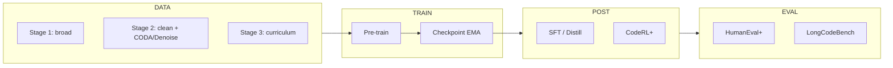

# 150m-

<div align="center">

| Python | PyTorch | License |
|--------|---------|---------|
| 3.10+  | 2.1+    | See repo |

**Code-only decoder. 100–150M parameters. Single RTX 3090. HumanEval+ / MBPP+ / LiveCodeBench.**

</div>

---

## Design & objectives

- **Setting:** Code generation in the 100–150M parameter regime; single-GPU training (24 GB VRAM).
- **Objective:** Maximise functional correctness (pass@1, pass@10) on held-out code benchmarks while staying an order of magnitude smaller than typical 1B+ general-purpose baselines.
- **Metrics:** pass@1 / pass@10 (EvalPlus on HumanEval+ and MBPP+), repair success rate (fix-after-feedback), and long-context performance (LongCodeBench 128K/512K) where applicable.
- **Reproducibility:** All hyperparameters and data-stage definitions in YAML; fixed seed in config; `verify_plan.py` and `run_smoke_test.sh` lock the pipeline to a single, documented plan.

---

## What this is

- **Model:** Decoder-only transformer, ~150M params (44 layers, d_model=384). Code-only: no general text, no chat.
- **Goal:** Strong pass@1 on code benchmarks with a model 10× smaller than typical 1B+ baselines. Training fits one RTX 3090 (24 GB).
- **Stack:** Three-stage data (broad → clean/edu → curriculum), stage-wise LRs, checkpoint EMA, optional BitNet/BLT/CodeRL+/test-time evolution. Config-driven; no placeholders in the critical path.

---

## Pipeline (high level)



| Stage   | Role |
|--------|------|
| **Data** | 3 stages (config: `data/config_data.yaml`). Stage 1: Stack/Stack-Edu, moderate filters. Stage 2: stricter + CODA + CodeDenoise. Stage 3: synthetic docstring→code→tests, execution filter. RegMix proxy for mixture tuning. |
| **Pre-train** | `training/train.py`: stage-wise LRs, AdamW param groups, checkpoint EMA, L-MTP curriculum, gradient checkpointing. |
| **Post-train** | Optional: StepCoder-style curriculum, SFT on green-only trajectories, trajectory distillation, CodeRL+ (execution semantics). |
| **Eval** | EvalPlus (pass@1 / pass@10), repair rate, LongCodeBench 128K/512K. |

---

## Architecture (default)

| Component | Setting |
|-----------|---------|
| Layers   | 44      |
| d_model  | 384     |
| Heads    | 6       |
| Vocab    | 16k BPE |
| Max len  | 1024    |
| Extras   | QK-norm, value residual, per-head gating. Optional: BitLinear, BLT, Mamba-2 hybrid, LEAM++. |

Defined in `model/config.py` and `training/config_train.yaml`. No custom CUDA kernels required.

---

## Quick start

<details>
<summary><b>1. Clone and install</b></summary>

```bash
git clone https://github.com/Lugier/150m-.git
cd 150m-
python -m venv venv && source venv/bin/activate
pip install -r requirements.txt
```

</details>

<details>
<summary><b>2. Verify</b></summary>

```bash
python verify_plan.py    # 27 checks (data → model → train → eval → RunPod)
bash run_smoke_test.sh  # 20-step train + inference + final.pt check
```

Both must pass before a real run.

</details>

<details>
<summary><b>3. Data (optional; if you want real training)</b></summary>

Data are not included. Example: pull Stage 1 from Hugging Face and train a tokenizer:

```bash
python data/prepare_data.py --config data/config_data.yaml --stage stage1 \
  --dataset bigcode/the-stack-smol --max_docs 5000 --output data/processed/stage1.jsonl
python data/tokenizer_train.py --input data/processed/stage1.jsonl --output data/tokenizer --vocab_size 16384
```

Without these, training uses dummy data so the script still runs (e.g. smoke test).

</details>

<details>
<summary><b>4. Train</b></summary>

```bash
# Short local run
python training/train.py --config training/config_train.yaml --checkpoint_dir checkpoints --max_steps 500

# RunPod: start command
cd /workspace/150m- && bash runpod_train.sh
```

Checkpoints: `checkpoints/ckpt_*.pt`, `checkpoints/final.pt`. EMA is applied at the end when enabled in config.

</details>

<details>
<summary><b>5. Inference</b></summary>

```bash
python inference/run_torch.py --checkpoint checkpoints --prompt "def fib(n):" --max_tokens 128
```

Apple Silicon: `inference/run_mlx.py` (requires MLX model export).

</details>

---

## Repo layout

```
├── data/           prepare_data, config_data.yaml, regmix_proxy, coda, code_denoise, dataloader, tokenizer_train
├── model/           config, gpt, bitnet, blt, leam, mamba_hybrid
├── training/        train.py, scheduler, config_train.yaml, step
├── post_training/   curriculum, sft_trajectories, distill, coderl_plus, config_post.yaml
├── inference/       run_torch, run_mlx, test_time_evolution, export_gguf
├── evaluation/      eval_loss, eval_humaneval, eval_repair, eval_livecode, eval_lcb
├── verify_plan.py   27 plan-alignment checks
├── run_smoke_test.sh
├── runpod_train.sh  RunPod RTX 3090
├── runpod_run.py
├── colab_train.ipynb
└── requirements.txt
```

---

## RunPod (RTX 3090)

1. Pod: RTX 3090, persistent volume at `/workspace`.
2. Clone repo to `/workspace/150m-`. Put data/tokenizer under `/workspace/llm_plus_data/` if you use them.
3. Start command: `cd /workspace/150m- && bash runpod_train.sh` (or `python3 runpod_run.py`).
4. Checkpoints: `/workspace/llm_plus_checkpoints/`.

---

## Evaluation

| Benchmark     | Script / usage |
|---------------|----------------|
| HumanEval+ / MBPP+ | `evaluation/eval_humaneval.py` → EvalPlus pass@1, pass@10 |
| Repair rate   | `evaluation/eval_repair.py` |
| LongCodeBench | `evaluation/eval_lcb.py` (128K / 512K, folding) |
| LiveCodeBench | `evaluation/eval_livecode.py` |

---

## References

| Work | Role in this codebase |
|------|------------------------|
| IMU-1 | Three-stage pretraining, stage-wise learning rates, checkpoint EMA |
| SmolLM2 / Stack-Edu | Code-centric data mix and stage design |
| RegMix | Proxy-based mixture optimisation for pretraining data |
| BitNet b1.58 | Optional 1.58-bit linear layers (BitLinear) |
| CodeRL+ | Optional variable-level execution semantics and reward |
| EvalPlus | HumanEval+ / MBPP+ evaluation (pass@k) |

Further pointers and plan are in the repo; when using this work in publications, cite this repository and the corresponding papers.

---

## License and data

- **Code:** See LICENSE in the repo.
- **Data:** Not shipped. When using The Stack v2 / Stack-Edu, follow their terms (Hugging Face, SWH). Checkpoints: you own use and distribution.

---

<div align="center">

**150m-** — 100–150M code-only decoder, single-GPU training, plan-aligned pipeline.

</div>
